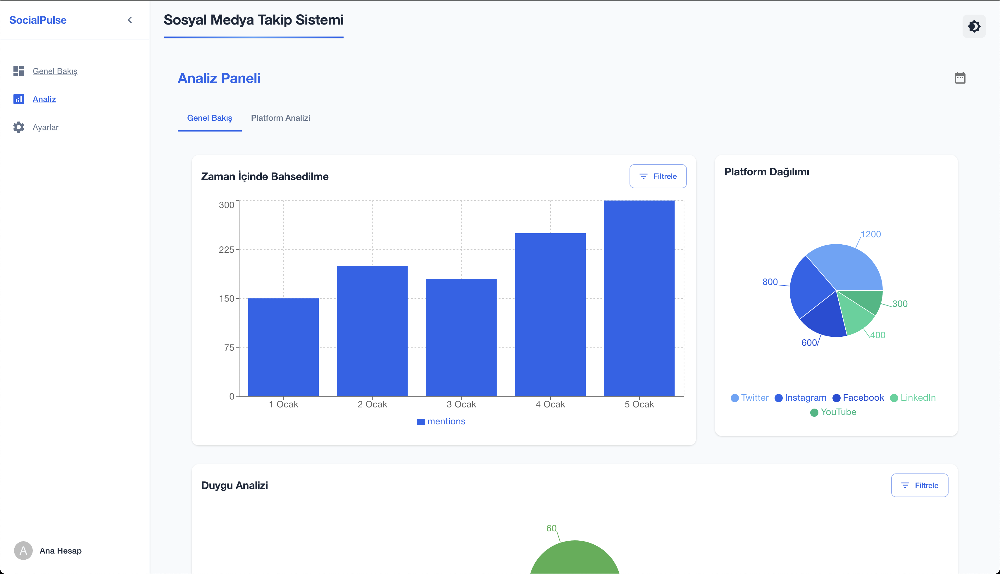
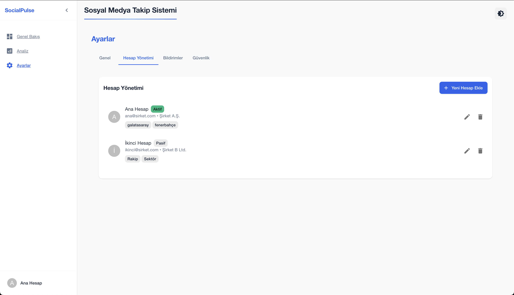
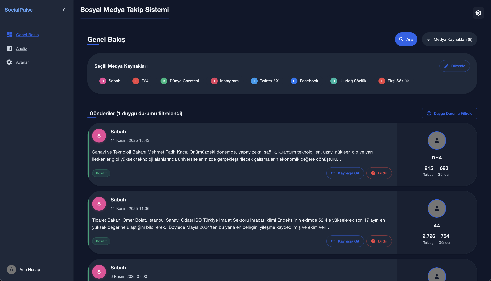
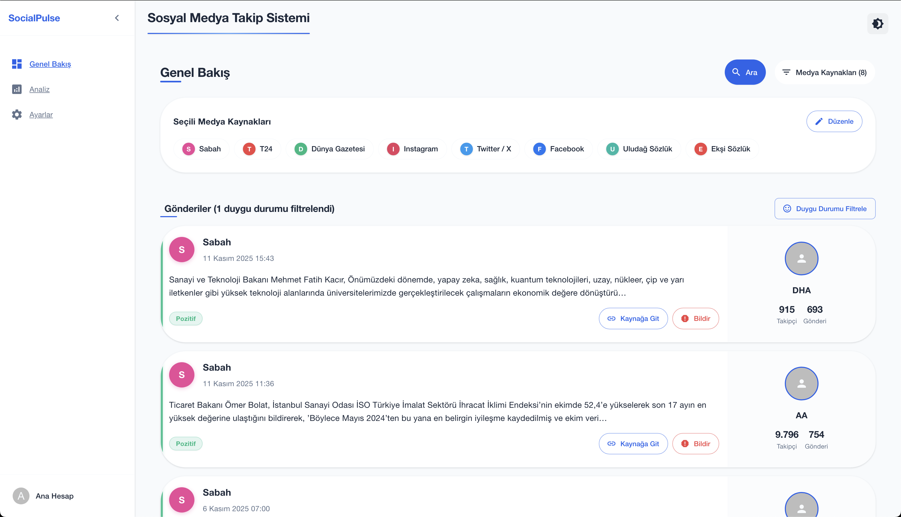
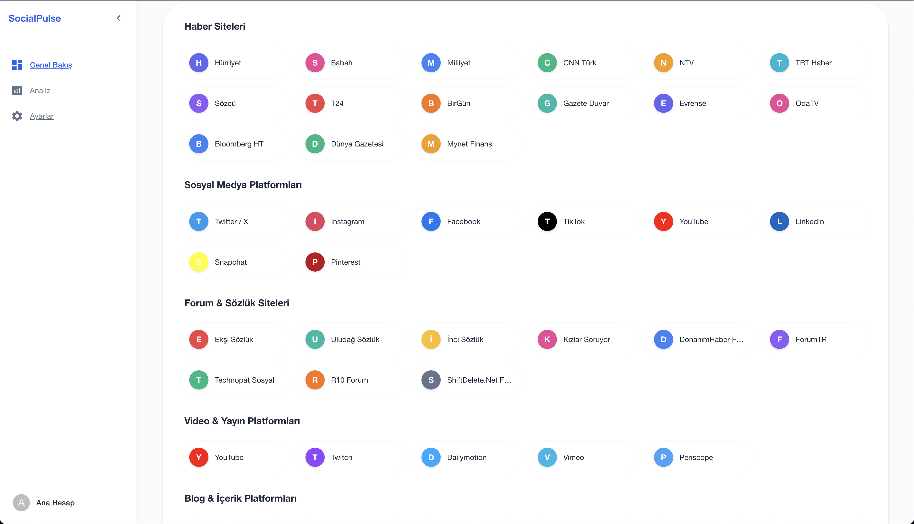

# SocialPulse: Social Media Listening and Analysis Platform

<div align="right">
  <strong>Language / Dil:</strong> 
  <a href="README.md">🇬🇧 English</a> | 
  <a href="README_TR.md">🇹🇷 Türkçe</a>
</div>

A modern, real-time social media monitoring and sentiment analysis platform designed for brands and individuals to track online presence, analyze sentiment, and gain insights from social media conversations.

**Quick Links:** [📸 Screenshots](#screenshots) • [Features](#features) • [Installation](#installation) • [Usage](#usage) • [API Documentation](#api-documentation)

---

## Table of Contents

- [About](#about)
- [Features](#features)
- [Technology Stack](#technology-stack)
- [Installation](#installation)
- [Configuration](#configuration)
- [Usage](#usage)
- [Screenshots](#screenshots)
- [Project Structure](#project-structure)
- [API Documentation](#api-documentation)
- [Contributing](#contributing)
- [Troubleshooting](#troubleshooting)
- [License](#license)

---

## About

SocialPulse is a comprehensive social media listening and analysis platform that aggregates data from multiple sources including news websites, social media platforms, forums, blogs, and messaging applications. The platform provides a unified dashboard for real-time monitoring, sentiment analysis, and comprehensive analytics.

### Key Capabilities

- Real-time monitoring across multiple media sources simultaneously
- Automated sentiment classification (Positive, Negative, Neutral)
- Multi-source data aggregation from news sites, social media, forums, and more
- Advanced filtering by source, sentiment, date range, and keywords
- Interactive visual analytics with charts and graphs
- Multi-account management with configurable keyword sets

---

## Features

### Core Features

- **Real-time Data Collection**: Automatically fetch and update posts from selected media sources
- **Sentiment Analysis**: AI-powered sentiment classification using natural language processing
- **Analytics Dashboard**: Comprehensive analytics with interactive charts and visualizations
- **Modern User Interface**: Clean, minimal, and professional interface with dark mode support
- **Multi-account Management**: Manage multiple accounts with different configurations and keyword sets
- **Responsive Design**: Fully responsive design that works seamlessly on desktop, tablet, and mobile devices
- **Multi-language Support**: Turkish and English language support
- **Performance Optimization**: Optimized caching and efficient data processing

### Supported Media Sources

The platform supports monitoring from the following categories:

**News Websites**
- Hürriyet, Sabah, Milliyet, CNN Türk, NTV, TRT Haber, Sözcü, T24, BirGün, Gazete Duvar, Evrensel, OdaTV, Bloomberg HT, Dünya Gazetesi, Mynet Finans

**Social Media Platforms**
- Twitter/X, Instagram, Facebook, TikTok, YouTube, LinkedIn, Snapchat, Pinterest

**Forums & Dictionaries**
- Ekşi Sözlük, Uludağ Sözlük, İnci Sözlük, Kızlar Soruyor, DonanımHaber Forum, ForumTR, Technopat Sosyal, R10 Forum, ShiftDelete.Net Forum

**Video & Broadcast Platforms**
- YouTube, Twitch, Dailymotion, Vimeo, Periscope

**Blog & Content Platforms**
- Medium, Blogger, WordPress, Onedio, Webtekno, Tumblr, Squarespace

**Messaging Platforms**
- Telegram, WhatsApp, Discord, Signal, Reddit

**Entertainment & Magazine Sites**
- Onedio, Acunn, MedyaTava, RaniniTV, MagazinNot

### Analytics Features

- **Timeline Analysis**: Track mentions over time with interactive bar charts
- **Platform Distribution**: Visualize data distribution across different platforms using pie charts
- **Sentiment Breakdown**: Analyze sentiment distribution with detailed charts
- **Platform Comparison**: Compare performance metrics across different media sources
- **Category Analysis**: Analyze data by category (News, Social Media, Forums, etc.)
- **Engagement Metrics**: Track engagement rates, reach, and other key performance indicators

---

## Technology Stack

### Frontend

- **React 19.0.0**: Modern UI library for building user interfaces
- **TypeScript 4.9.5**: Type-safe JavaScript for improved code quality
- **Material-UI (MUI) 5.15.14**: Comprehensive React component library
- **Tailwind CSS 3.4.3**: Utility-first CSS framework
- **Recharts 2.15.1**: Composable charting library built on React components
- **Chart.js 4.4.2**: Additional charting capabilities
- **React Router 6.22.3**: Declarative routing for React applications

### Backend

- **Python 3.10+**: High-level programming language
- **Flask 2.0.1**: Lightweight WSGI web application framework
- **Flask-CORS 3.0.10**: Flask extension for handling Cross-Origin Resource Sharing
- **MySQL**: Relational database management system (optional, for future features)
- **News API**: Third-party API for news data aggregation
- **TextBlob**: Python library for processing textual data
- **NLTK**: Natural Language Toolkit for natural language processing

### Development Tools

- **Node.js 20+**: JavaScript runtime environment
- **npm**: Node package manager
- **Git**: Distributed version control system

---

## Installation

### Prerequisites

Before you begin, ensure you have the following installed on your system:

- **Node.js** (v20 or higher) - [Download](https://nodejs.org/)
- **Python** (v3.10 or higher) - [Download](https://www.python.org/)
- **pip**: Python package manager (usually included with Python)
- **MySQL** (optional): Required only if you plan to use database features

### Step 1: Clone the Repository

```bash
git clone https://github.com/yourusername/Social-Pulse.git
cd Social-Pulse
```

### Step 2: Backend Setup

1. Navigate to the backend directory:
```bash
cd backend
```

2. Create a virtual environment:
```bash
python3 -m venv venv
```

3. Activate the virtual environment:

   **On macOS/Linux:**
   ```bash
   source venv/bin/activate
   ```

   **On Windows:**
   ```bash
   venv\Scripts\activate
   ```

4. Install Python dependencies:
```bash
pip install -r requirements.txt
```

5. (Optional) Set up MySQL database:
```bash
mysql -u root -p < init_db.sql
```

6. Configure environment variables:
   Copy the example environment file and update with your values:
   ```bash
   cp .env.example .env
   ```
   Then edit `.env` file with your actual values:
   ```env
   NEWS_API_KEY=your_news_api_key_here
   DB_HOST=localhost
   DB_USER=root
   DB_PASSWORD=your_password
   DB_NAME=social_listening
   ```

### Step 3: Frontend Setup

1. Navigate to the frontend directory:
```bash
cd ../frontend
```

2. Install Node.js dependencies:
```bash
npm install
```

### Step 4: Start the Application

#### Option 1: Using the Start Script (Recommended)

From the project root directory:
```bash
chmod +x start.sh
./start.sh
```

#### Option 2: Manual Start

**Terminal 1 - Backend:**
```bash
cd backend
source venv/bin/activate  # On Windows: venv\Scripts\activate
python app.py
```

**Terminal 2 - Frontend:**
```bash
cd frontend
npm start
```

The application will be available at:
- **Frontend**: http://localhost:3000
- **Backend API**: http://localhost:5004

---

## Configuration

### Backend Configuration

Edit `backend/app.py` to configure the following settings:

- **Database Connection**: Update the `DB_CONFIG` dictionary with your MySQL credentials
- **API Keys**: Set your News API key in the `NEWS_API_KEY` variable
- **CORS Settings**: Configure allowed origins in the CORS configuration
- **Cache Duration**: Adjust the `CACHE_DURATION` constant to modify cache expiration time (default: 900 seconds)

### Frontend Configuration

Edit `frontend/src/App.tsx` to configure:

- **API Endpoint**: Update the backend API URL if running on a different port
- **Theme Settings**: Customize the color scheme and theme preferences
- **Language**: Set the default language (Turkish or English)

### News API Key Setup

News data requires a News API key. You can configure it in two ways:

#### Option 1: Enter from the UI (Recommended)

1. Sign up for a free account at [NewsAPI.org](https://newsapi.org/)
2. Obtain your API key from the dashboard
3. In the app, go to **Settings → General → News API Key**
4. Paste your key and click **Save**
5. Return to the dashboard and click **Search**

The key is stored in your browser and sent to the backend via the `X-News-Api-Key` header.

#### Option 2: Backend Environment Variable

If you want a server-side default key, add it to your `backend/.env` file:

```bash
NEWS_API_KEY=your_news_api_key_here
```

For the Vercel backend deployment, add the same variable in **Project Settings → Environment Variables**.

---

## Usage

### Getting Started

1. Start the application following the installation instructions above

2. Open your web browser and navigate to `http://localhost:3000`

3. Select Media Sources:
   - Click the "Medya Kaynakları" (Media Sources) button in the dashboard
   - Choose the sources you want to monitor from the categorized list
   - Selected sources will appear in the "Seçili Medya Kaynakları" section

4. Configure Keywords (Optional):
   - Navigate to Settings → Account Management
   - Select or create an account
   - Add keywords that you want to track
   - These keywords will be used for filtering and searching posts

5. Enter Your News API Key:
   - Go to Settings → General → News API Key
   - Save your NewsAPI.org key

6. Search for Posts:
   - Click the "Ara" (Search) button to fetch posts from selected sources
   - Posts will appear in the main dashboard with sentiment analysis

### Dashboard Features

- **Filter by Source**: Click on selected media source chips to filter posts by specific sources
- **Filter by Sentiment**: Use the "Duygu Durumu Filtrele" button to filter posts by sentiment (Positive, Negative, Neutral)
- **View Post Details**: Click "Kaynağa Git" to open the original post in a new tab
- **Report Content**: Use the "Bildir" button to report inappropriate or harmful content

### Analytics

Navigate to the "Analiz" (Analysis) section to access:

- **Timeline Analysis**: View mentions over time with interactive bar charts
- **Platform Distribution**: See data distribution across different platforms using pie charts
- **Sentiment Analysis**: Analyze sentiment breakdown with detailed visualizations
- **Platform Comparison**: Compare performance metrics across different media sources
- **Category Analysis**: Analyze data grouped by category (News, Social Media, Forums, etc.)

### Settings

Access settings via the sidebar navigation:

- **General**: Configure theme preferences (light/dark mode) and language settings
- **Account Management**: Add, edit, or delete accounts with different keyword configurations
- **Notifications**: Configure email and push notification preferences
- **Security**: Manage two-factor authentication and password settings

---

## Screenshots

### 1. Analytics Panel

*Comprehensive analytics panel with timeline analysis, platform distribution, and sentiment analysis charts*

### 2. Settings Page

*Account management interface showing account list with keywords and management options*

### 3. Dashboard - Dark Mode

*Main dashboard in dark mode showing selected media sources and posts with sentiment analysis*

### 4. Dashboard - Light Mode

*Main dashboard in light mode displaying posts, media sources, and author information*

### 5. Media Source Selection

*Media source selection interface organized by categories (News Sites, Social Media, Forums, etc.)*

> **Note**: Add your screenshots to the `screenshots/` directory with the following filenames:
> - `01-analytics.png` - Analytics panel screenshot
> - `02-settings.png` - Settings page screenshot
> - `03-dashboard-dark.png` - Dark mode dashboard screenshot
> - `04-dashboard-light.png` - Light mode dashboard screenshot
> - `05-media-sources.png` - Media source selection screenshot

---

## Project Structure

```
SocialPulse/
├── backend/
│   ├── app.py                 # Main Flask application
│   ├── requirements.txt       # Python dependencies
│   ├── init_db.sql           # Database initialization script
│   └── venv/                 # Python virtual environment
├── frontend/
│   ├── public/               # Static files and assets
│   ├── src/
│   │   ├── components/       # React components
│   │   │   ├── Dashboard.tsx
│   │   │   ├── Analytics.tsx
│   │   │   ├── Settings.tsx
│   │   │   ├── Sidebar.tsx
│   │   │   └── ...
│   │   ├── App.tsx           # Main application component
│   │   └── index.tsx         # Application entry point
│   ├── package.json          # Node.js dependencies and scripts
│   └── tsconfig.json         # TypeScript configuration
├── screenshots/              # Application screenshots
├── start.sh                  # Application startup script
└── README.md                 # Project documentation
```

---

## API Documentation

### Endpoints

#### GET `/api/posts`

Fetch posts from selected media sources based on provided filters.

**Query Parameters:**
- `sources[]` (array, optional): Array of source IDs to filter by (e.g., `sources[]=hurriyet&sources[]=sabah`)
- `keywords[]` (array, optional): Array of keywords to search for
- `search` (string, optional): General search query string

**Response:**
```json
[
  {
    "id": "post_id",
    "title": "Post Title",
    "sourceId": "hurriyet",
    "content": "Post content...",
    "author": {
      "name": "Author Name",
      "avatar": "/avatars/default.png",
      "followers": 1000,
      "posts": 500
    },
    "sentiment": "positive",
    "date": "2025-11-11T15:43:00Z",
    "sourceUrl": "https://..."
  }
]
```

#### GET `/api/sources`

Retrieve list of all available media sources.

**Response:**
```json
{
  "sources": [
    {
      "id": "hurriyet",
      "name": "Hürriyet",
      "logo": "/logos/hurriyet.png"
    }
  ]
}
```

#### GET `/api/search`

Search for posts using a query string.

**Query Parameters:**
- `search` (string, required): Search query string
- `sources[]` (array, optional): Array of source IDs to limit search scope

**Response:**
Same format as `/api/posts`

---

## Contributing

We welcome contributions to SocialPulse. Please follow these guidelines:

1. **Fork the repository** to your GitHub account

2. **Create a feature branch**:
   ```bash
   git checkout -b feature/your-feature-name
   ```

3. **Make your changes** and ensure all code follows the existing style guidelines

4. **Test your changes** thoroughly before submitting

5. **Commit your changes** with clear, descriptive commit messages:
   ```bash
   git commit -m 'Add feature: description of changes'
   ```

6. **Push to your branch**:
   ```bash
   git push origin feature/your-feature-name
   ```

7. **Open a Pull Request** with a detailed description of your changes

### Development Guidelines

- Follow the existing code style and conventions
- Write meaningful commit messages following conventional commit format
- Add comments for complex logic and algorithms
- Ensure all tests pass before submitting
- Update documentation for any new features or API changes
- Keep pull requests focused on a single feature or fix

---

## Troubleshooting

### Common Issues

**Backend not starting:**
- Ensure Python virtual environment is activated
- Verify that port 5004 is not already in use
- Check that all dependencies are properly installed
- Review backend logs for specific error messages

**Frontend not starting:**
- Ensure Node.js v20 or higher is installed
- Delete `node_modules` directory and run `npm install` again
- Verify that port 3000 is not already in use
- Check browser console for JavaScript errors

**API errors:**
- Verify News API key is correct and active
- Check API rate limits and quota
- Ensure backend server is running and accessible
- Review network connectivity and firewall settings

**Database connection errors:**
- Verify MySQL server is running
- Check database credentials in configuration
- Ensure database exists and user has proper permissions
- Review database connection logs for specific errors

---

## License

This project is licensed under the MIT License. See the [LICENSE](LICENSE) file for details.

---

## Authors

- **Your Name** - Initial work - [GitHub Profile](https://github.com/yourusername)

---

## Repository Description

**Social-Pulse** is a modern, real-time social media listening and sentiment analysis platform. Monitor mentions across news sites, social media platforms, forums, and blogs. Features include automated sentiment classification, interactive analytics dashboards, multi-account management, and comprehensive filtering capabilities. Built with React, TypeScript, Flask, and Python.

---

## Acknowledgments

- NewsAPI.org for providing news data aggregation services
- Material-UI team for the comprehensive React component library
- All contributors and users who have helped improve this project

---

## Contact

For questions, suggestions, bug reports, or support, please open an issue on the GitHub repository.

---
